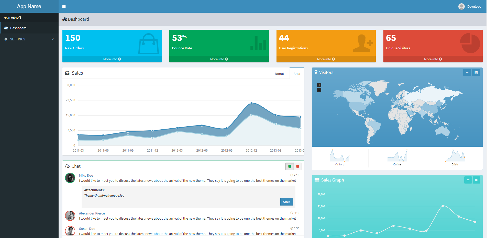

# system
 AdminLTE template Laravel 8 package

Start a new Laravel 8 project with the AdminLTE template installed.



# Installation

1) Create database.
2) Clone repository `git clone https://github.com/AlexSandoval99/system.git`
3) Copy `.env.example` to `.env`
3) cp .env.example .env
4) Set valid database credentials of env variables `DB_DATABASE`, `DB_USERNAME`, and `DB_PASSWORD`
5) Run `composer install` ,` composer require "laravelcollective/html":"^5.5.0"`

6) Create symbolic link for AdminLTE (Run the commands as an administrator)

- Windows example:

 ```php
 mklink /d "C:\laragon\www\system\public\assets\adminlte" "C:\laragon\www\system\vendor\almasaeed2010\adminlte"
 ```

7) Run
```php
php artisan migrate
```
```php
php artisan db:seed
```
```php
php artisan key:generate
```
```php
php artisan serve
```
8) Access the application.
9) Login: `admin@admin.com` Password: `root`
